# 减脂原理和知识储备

## 热量消耗

​		基础代谢+活动代谢+食物热效应

​		热量总消耗-热量总摄入=热量缺口

**基础代谢公式：**

> 男 67+13.73 × 体重（kg）+5 × 身高（cm）-6.9 × 年龄
>
> 女 661 + 9.6 × 体重（kg）+1.72 × 身高（cm）-4.7 × 年龄

**活动代谢公式：**

> 基础代谢 α × 系数 λ

| 运动量          | 不运动   | 每周2~3练 | 每周4~5练 | 每周6练以上 |
| --------------- | -------- | --------- | --------- | ----------- |
| 实际消耗（1+λ） | α × 1.15 | α × 1.4   | α ×1.6    | α ×1.8      |

## 吃什么？

*吃饱的情况下，又要减肥？？？？*

**热量密度低的食物（相同热量下饱腹感更强）**

- **蛋白质摄入：每天每公斤2g（一说 2g过多，普通人1.5即可）**。

  - 4kcal/g

  - **优先吃**

  - **食物热销应高**

  - 瘦肉

  - 100g瘦肉营养成分：

    | 热量       | 143lca |
    | ---------- | ------ |
    | 蛋白质     | 20.3g  |
    | 碳水化合物 | 1.5g   |
    | 脂肪       | 6.2g   |

- **碳水化合物：**

  - 4kcal/g
  - 米饭馒头
- **脂肪：**

  - 9kcal/g
  - 食用油和肥肉

- **蔬菜和水：**
  - 多吃多喝

## 吃饱的情况下，减肥

### 一、制造热量缺口

每日热量缺口 500 kcal | **减掉1kg纯脂肪 7000~8000kcal**

> 500 kcal 热量缺口 不快不慢
>
> 基础代谢 67+13.73 × 85 + 5 × 175 - 6.9 × 22 = 1957.25
>
> 实际消耗 α × 1.15 =  2250.84
>
> 每天摄入上限：2250.84-500=1750.84

### 二、估算摄入量

**热量估算法：用拳头**

1. **蛋白质摄入** 一拳 /男

| 食物种类    | 蛋白质/g | 热量/kcal |
| ----------- | -------- | --------- |
| 纯瘦肉      | 30       | 210       |
| 全鸡蛋      | 7        | 73        |
| 纯牛奶/豆浆 | 8        | 166       |
| 豆腐        | 8        | 109       |

2. **碳水化合物摄入** 白饭 白馒头 一拳/男

ps：**面条和粥禁食**

| 食物种类                                              | 碳水/g | 热量/kcal |
| ----------------------------------------------------- | ------ | --------- |
| 主食                                                  | 52     | 232       |
| 水果 （香蕉，榴莲，牛油果，椰子肉，果脯，果汁🈲） | 20     | 80        |
| 切片面包（非运动期间🈲）                               | 15     | 90        |

3. **脂肪**  一拳/男

ps：**肥肉，动物皮，油炸食品 禁食**

| 食物种类 | 脂肪/g | 热量/kcal |
| -------- | ------ | --------- |
| 小坚果   | 10     | 114       |

4. **蔬菜** 必吃500g（4拳量）
   1.  两拳绿叶菜
   2. 圣女果/小黄瓜
5. **水** 2L以上
   1. 水解消化
   2. 占胃口

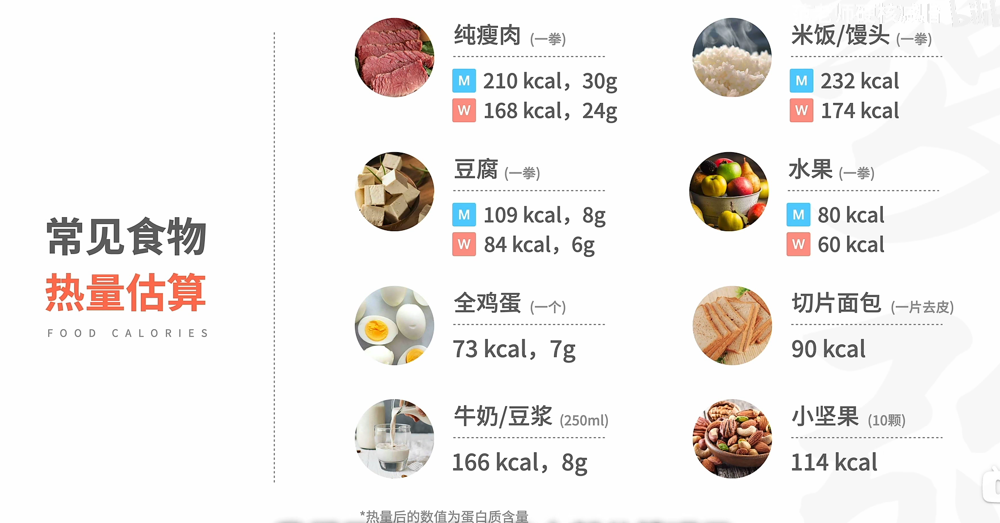

### 三、制定食谱

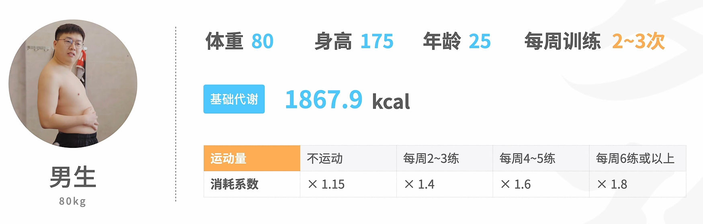

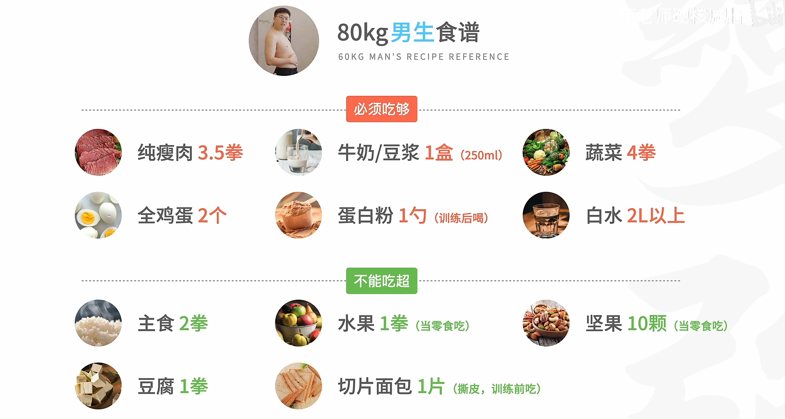

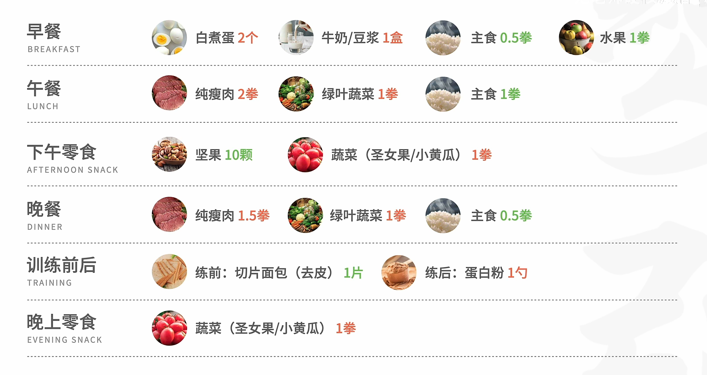

## 代餐问题

**特点：热量低，饱腹感强**

**思路：基础饮食吃好，代餐辅助调整摄入**

>  **更推荐高蛋白代餐**

- 场景一：三餐吃多了，但是又饿了
  - 吃一份

- 场景二：累了，嘴馋。
  - 吃一份
- 场景三：出差/聚餐，条件有限
  - 先吃一份代餐。

## 体重不重要/减脂训练原理

**减脂必须增肌**

**增肌好处：**

- **搭建好身材**

- **提高减脂效率**
- **带来更多热量代谢**

**低强度有氧（eg：慢跑）**

- 消耗强度低

- 心肺能力提升不够好
- 长时间有氧，**影响肌肉量维持**
- *门槛低*

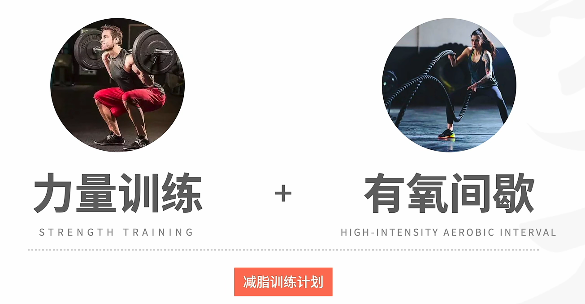

## 减脂阶段

- 阶段一：吊秤期。
  - 糖原和水分短暂流失。
- 阶段二：减脂期
  - 半年到一年
  - BMI 大体重 掉秤更快

- 阶段三：平稳期
  - 一年+

# 健身房减脂训练计划

**力量训练+有氧间歇** **每周至少3次**

1. 5~10分钟有氧器械
   - 练前准备
2. 活动关节
3. 开始

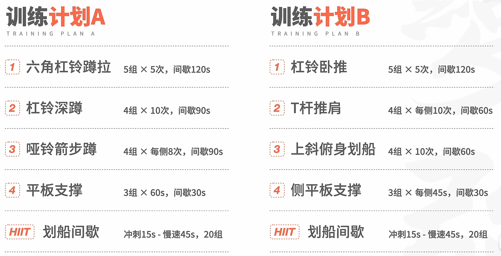

## 训练计划A

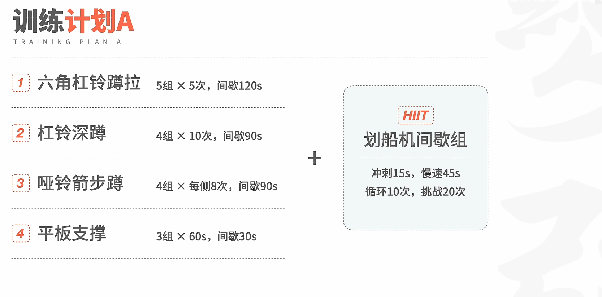

#### **六角杠铃蹲拉**

*没有的话用两个大哑铃代替*

- 双脚比肩略宽；挺胸收背；紧绷腰腹核心；臀部水平后推；膝盖往两边打开；膝盖适当往脚尖方向滑动。
- **腰背用力挺直**；**大腿和臀部发力**
- **臀部大幅度后推**；**腰背始终一条线**
- 膝盖和脚尖方向一致，无内扣

> **组数**：5组
>
> **次数**：5次
>
> **间歇**：2min
>
> **要领**：最后一组高质量完成，下次加重

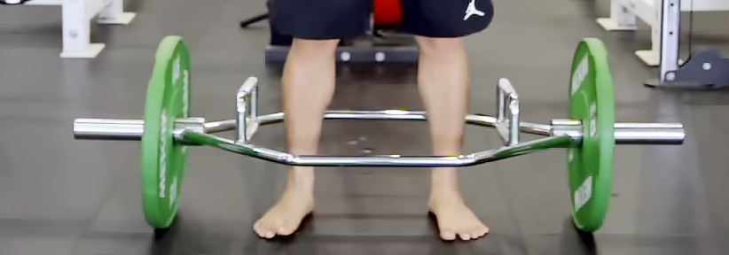

#### 杠铃深蹲

*没经验用哑铃高脚杯深蹲*

- 双脚比肩略宽；挺胸收背；收紧腰腹核心
- **轻微外八**；**臀部后推** 
- **膝盖向两边打开，往脚尖方向滑动**
- **大腿和臀部发力**

**ps ：重心在足弓处，腰背一条直线，膝盖位置可以超过脚尖（不要太多）**

> **组数**：4组
>
> **次数**：10次
>
> **间歇**：90s
>
> **要领**：最后一组高质量完成，下次加重

#### 哑铃箭步蹲

- 右脚前跨，顺势下蹲
- **最低点，小腿和膝盖90°** ；**左腿顺势发力站起**

- 完成后，调整呼吸
- 交换重复

**ps ：保持中立，不要左右乱晃**

> **组数**：4组
>
> **次数**：各8步
>
> **间歇**：90s
>
> **要领**：动作彻底稳定后，下次加重

#### 平板支撑

*略*

> **组数**：3组
>
> **时长**：60s
>
> **间歇**：30s
>
> **要领**：全程用力紧绷肌肉

#### HIIT 划船机间歇组

- 慢速划船1min；冲刺15s；慢速45s

循环10次，挑战20次

> **组数**：10次 Goal 20次
>
> **时长**：60s
>
> **要领**：高低速切换，循环训练

## 训练计B

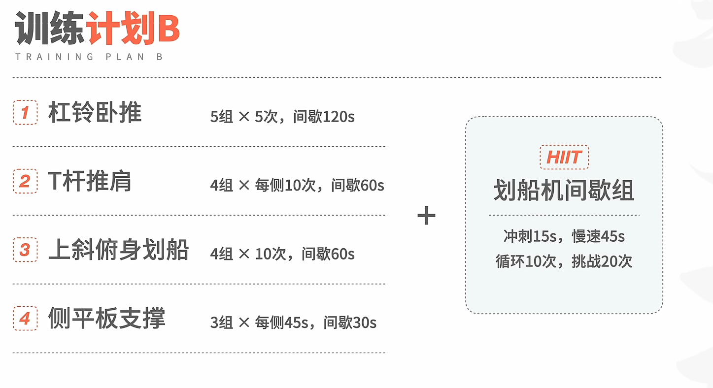

#### 杠铃卧推

*先用空杆尝试*

- **肩胛骨后缩下压，保持收紧**
- 双手伸直，杠铃杠不超过手腕；眼睛处于正下方
- 小拇指对准杠铃两侧内线，掌心贴在杠铃杆下方，稍微内旋手掌  
- 手腕处于正下方 ；腰部收紧；双脚踩稳；肩部往中间收一收
- 推起杠铃，垂直身体上方
  - 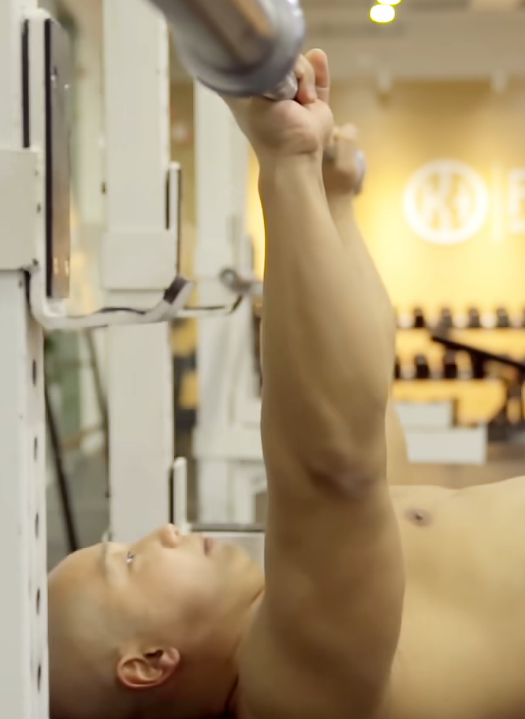

- 吸气。下放杠铃直到触碰胸部
- 呼气。上推至手臂接近伸直

**ps：小臂始终垂直地面；腰部不能大幅拱起；推至高点时肩胛骨也要贴着凳子，不可前送**

> **组数**：5组
>
> **次数**：5次
>
> **间歇**：2min
>
> **要领**：最后一组高质量完成，下次加重

#### T杆推肩

- **膝盖微曲**；面对杠铃站稳；绷紧腰腹
- 呼气。身体小幅转动，推动杠铃

> **组数**：3组
>
> **次数**：左右各10次
>
> **间歇**：60s
>
> **要领**：发力时收紧核心

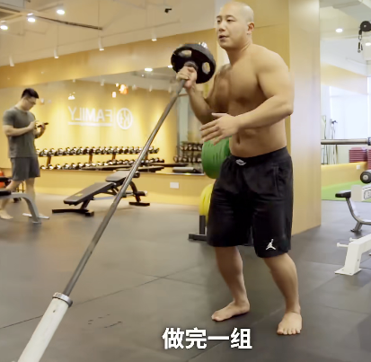

#### 上斜凳俯身划船

- 双脚蹬地
- 呼气。背部收紧，拉起哑铃
- 吸气。缓放哑铃。

> **组数**：4组
>
> **次数**：10次
>
> **间歇**：60s
>
> **要领**：每组都可以考虑到力竭

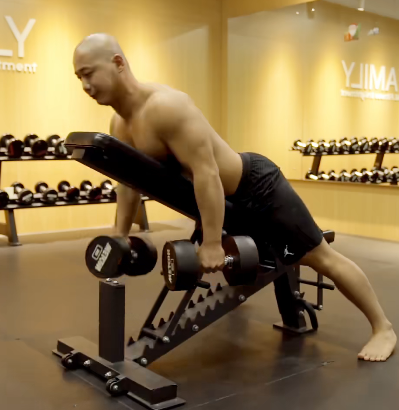

#### 侧平板支撑

*完全不行?膝盖撑地*

- 双腿交叉前后撑在垫子上
- 腰腹绷紧撑起身体
- 右手甚至指向天空

> **组数**：3组
>
> **次数**：每侧45s
>
> **间歇**：30s
>
> **要领**：全程用力紧绷全身肌肉

# 家庭减脂计划

**建议每周三天训练，有毅力的非训练日跑跑步**

准备：

- 弹力绳，增肌用。
- 瑜伽垫

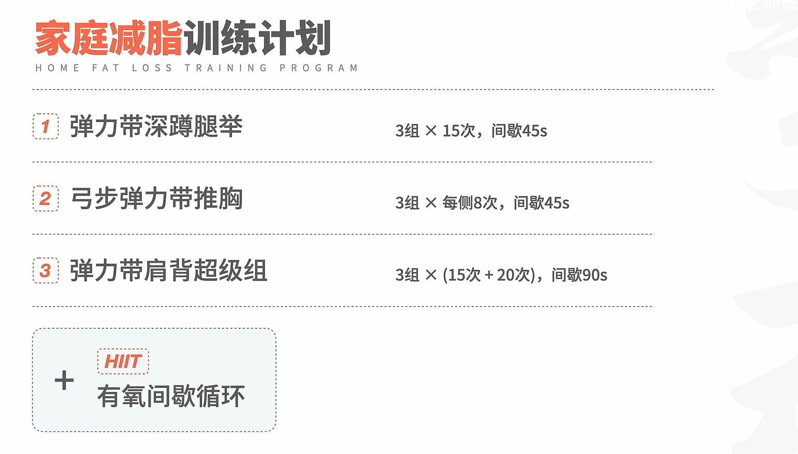

## 三个力量训练动作

#### 弹力绳深蹲推举

*高磅弹力绳*

- 双脚比肩略宽，踩在弹力绳中间
- 手臂往身体两侧张开，掌心超前；收紧腰腹
- 吸气。臀部后推；膝盖往两侧打开，顺势蹲下至**大腿与地面平行**
- 呼气。迅速站起；双手继续推至头顶上方触碰

**ps：中心在足弓，腰背挺直；手臂力竭后，取消上推，完成剩余次数**

> **组数**：3组
>
> **次数**：15次
>
> **间歇**：45s
>
> **要领**：每组都可以考虑到力竭，超过20次加重

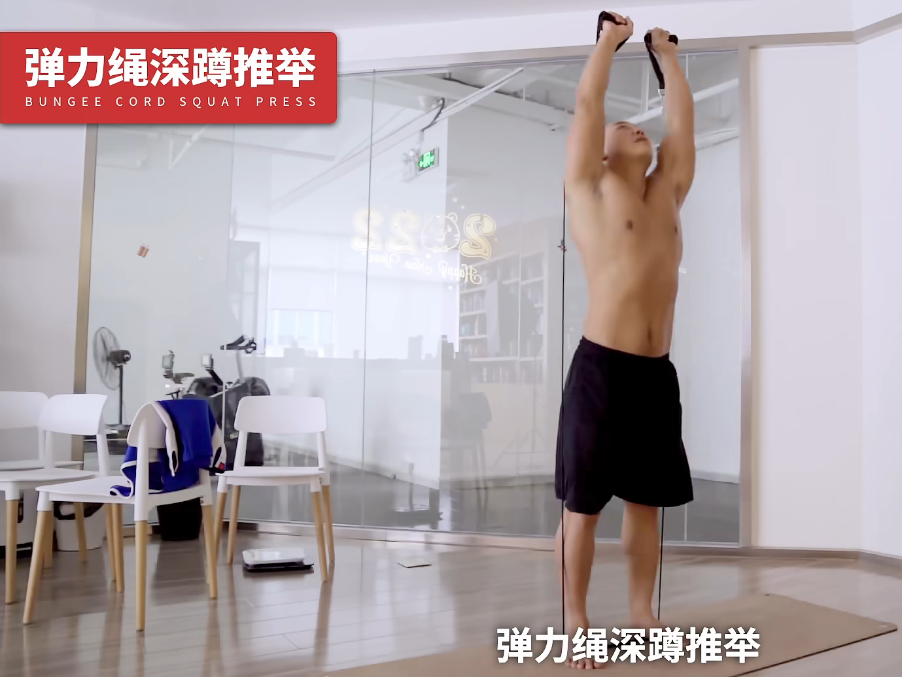

#### 弓步弹力绳推胸

*磅数中等弹力绳*

- 双手俯卧撑姿势握住弹力绳两端
- 前进至弹力绳拉直
- 收紧核心让上半身挺直
- 前跨弓步，**大腿与地面平行**，定住
- 推弹力绳至手臂伸直触碰，缓慢返回，弓腿发力返回。

**ps：难点：身体不稳；很难控制则换小磅数**

> **组数**：3组
>
> **次数**：16次
>
> **间歇**：45s
>
> **要领**：每组都可以考虑到力竭，超过24次加重

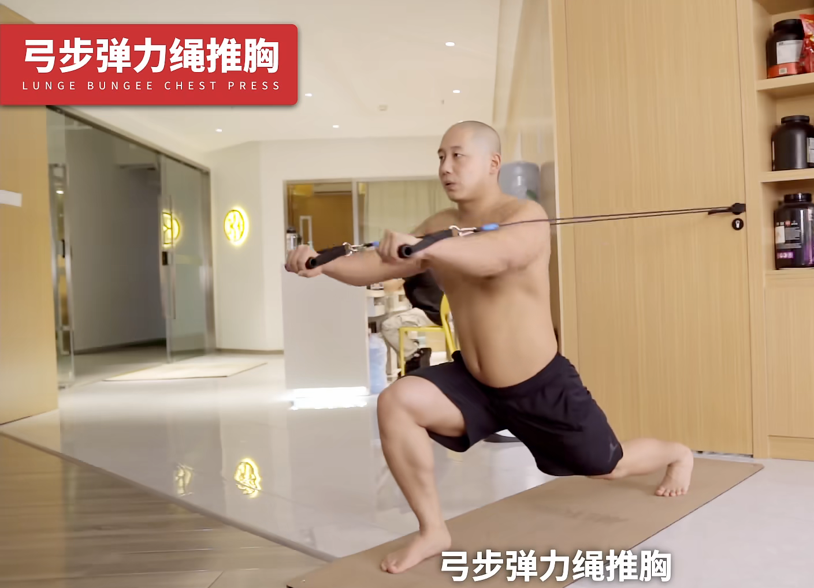

#### 弹力绳肩背超级组

*最大磅数弹力绳*

- 拉开弹力绳，**蹲至大腿与地面平行**，马步不动
- 呼气。拉绳，夹背。
- 吸气。缓慢返回。
- 力竭后，用低磅弹力绳，收紧腰腹核心，**做侧平举**
  - 吸气。抬手与肩部平齐。**保证肩高于肘，肘高于手**
  - 呼气。缓慢返回。
- **ps ：脖子两侧累，用力将双手往两侧远处延申**

> **组数**：3组
>
> **次数**：弹力绳拉背15次+侧平举力竭
>
> **间歇**：45s
>
> **要领**：每组都可以考虑到力竭，背部超过20次加重

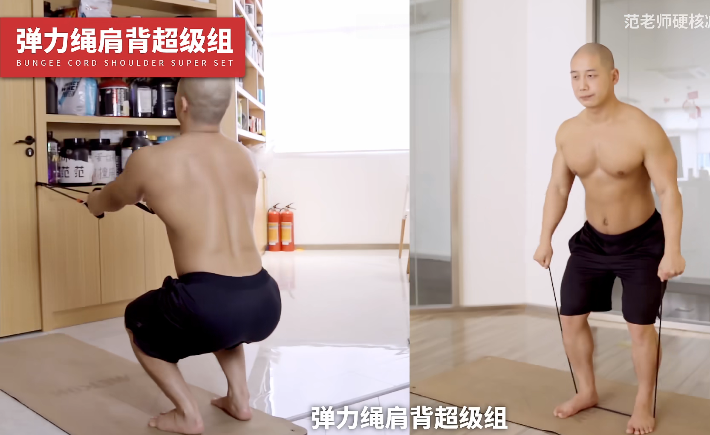

## 有氧间歇训练

1. 高抬腿 20秒
2. 弓步走 16步
3. 俯身起立 15次
4. 平板支撑 45秒

**ps：动作间隔严格休息==30s==**

> **组数**：3组
>
> **间歇**：2min

# 打造易瘦体质

> 改变日常行为习惯，达到长期增加身体消耗热量的效果

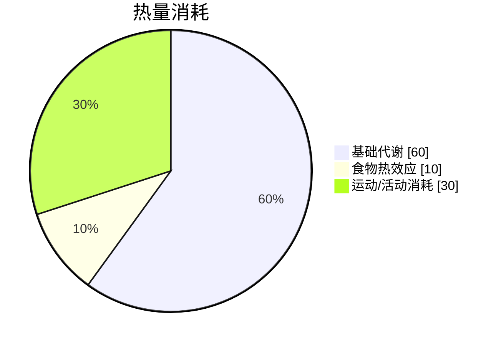

## 非运动性热量消耗 NEAT

> 日常生活热量消耗

**热量估算：体重 × 代谢当量 × 时间**

| 代谢当量 | 活动内容                                                |
| -------- | ------------------------------------------------------- |
| 1.0      | 静坐                                                    |
| 1.2      | 站立                                                    |
| 1.3      | 坐姿看书                                                |
| 1.5      | 轻松的坐姿活动:打电话、吃饭、开车、轻松办公、泡澡等     |
| 1.8      | 轻松的站姿活动:打电话、看书、做手工艺品等               |
| 2.0      | 简单的日常活动:烹饪、晾衣服、换衣服、吃饭、淋浴、慢走等 |
| 2.3      | 中等的日常活动:站若办公、站若洗碗、站着收衣服等         |
| 2.5      | 复杂的日常活动:练瑜伽、大扫除、骑电动车、玩乐器等       |
| 2.8      | 稍累的日常活动:陪孩子玩、陪宠物玩等                     |

# 减肥饮食禁忌清单

- 禁忌一：==无意识进食==

- 禁忌二：油脂陷阱
  - 🈲牛羊肉卷
  - 🈲鸡翅鸡爪
  - 🈲带皮肉类
  - 🈲动物内脏
  - 🈲加工肉类
  - 🈲炒蔬菜 建议涮掉油
  - 🈲酒精。==代谢劫持 ヽ(*。>Д<)o゜== **可以小酌，每周一瓶啤酒/2小杯白/红酒**
  - 🈲含糖饮料

